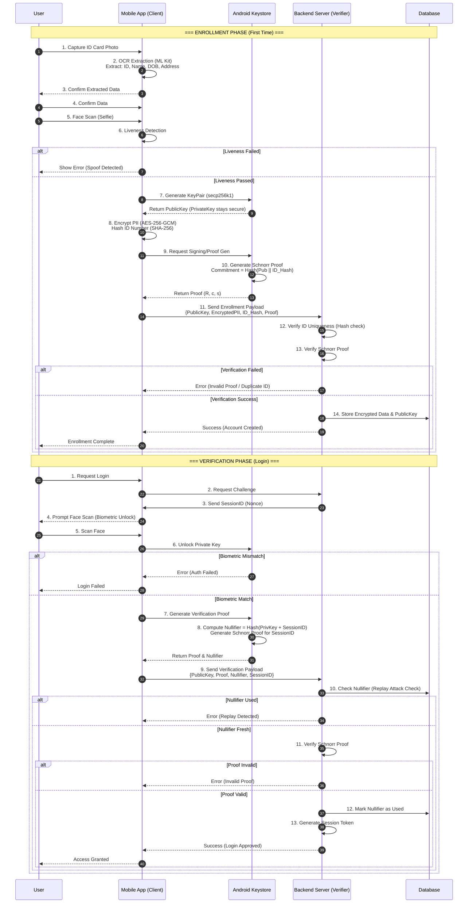

# System Flow Analysis: WannaW1n Banking App (eKYC + ZKP)

Based on the analysis of `README.md` and `ZKP_TECHNICAL.md`, here is the system flow diagram describing the Enrollment and Verification processes.

## System Architecture Overview

The system consists of two main entities:
1.  **Mobile Client (Prover)**: Handles OCR, Biometrics, ZKP generation, and PII encryption.
2.  **Server (Verifier)**: Handles ZKP verification, uniqueness checks, and encrypted storage.

## Flow Diagram

## Key Security Mechanisms

1.  **Zero-Knowledge Property**: The Server verifies the user's identity (possession of Private Key) without ever seeing the Private Key.
2.  **Biometric Binding**: The Private Key is locked in the Android Keystore and only released (for usage, not export) upon successful biometric authentication.
3.  **Replay Protection**: The `Nullifier` ensures that a valid proof for one session cannot be reused for another.
4.  **Data Privacy**: PII is encrypted on the client side. The server only holds encrypted blobs and hashes.
